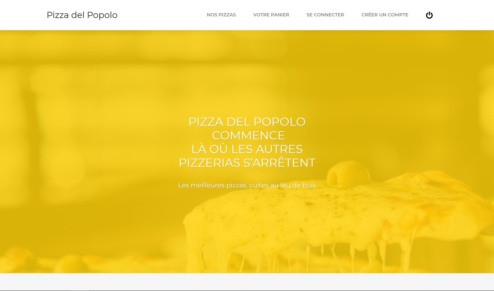

# Pizza del Popolo

## Install

`git clone https://github.com/paul-mathieu/pizza-popolo-v2.git`

`npm install`

`npm start`

## Use Exemple

#### Home page

#### Catalog Page

#### 404

## Issues

#### Cors not allowed

You need to enable CORS in your navigator, like [this](https://chrome.google.com/webstore/detail/allow-cors-access-control/lhobafahddgcelffkeicbaginigeejlf?hl=fr) for Chrome.

#### Menu Bar

If you open the menu bar in a minimized window, you could not be able to unfold it. For this to be possible, you must first load the window in full screen and then minimize it, then the button to expand the menu will work. 

Sometimes this doesn't work and I don't know how to fix this but if you have any ideas I'll listen.

#### Error loading Bootstrap

If you have any errors loading bootstrap, go to the location indicated by the error message and remove the link indicated in the css file. This error does not happen all the time.

